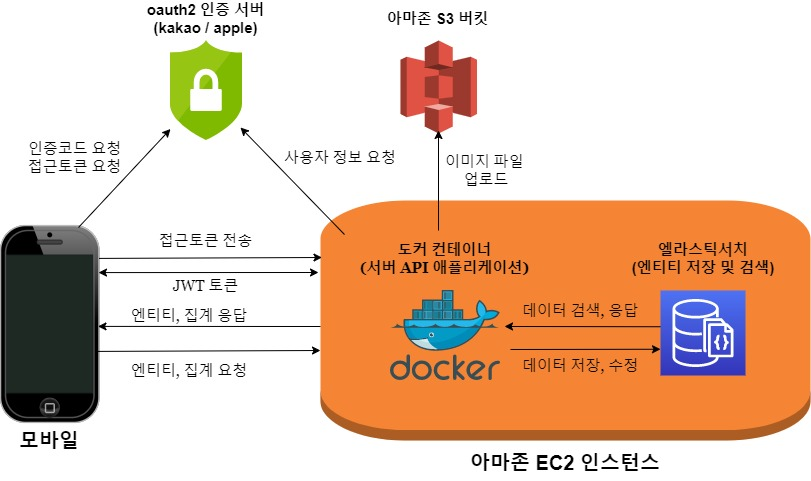

# 1. 프로젝트 소개

푸드트럭 소유주에게는 전국 푸드트럭 영업 허가구역 정보를 제공한다. 전국 푸드트럭 허가구역에 관한 데이터는 공공 데이터 포털(https://www.data.go.kr)에서 제공하는 파일 데이터를 가공 제공한다.

또한 소비자를 위해 주변에 있는 푸드트럭에 관한 정보(위치-경도/위도, 음식 메뉴, 현재 운영중 여부)를 제공한다.

# 2. 사용된 기술

- ElasticSearch
- Java 11 + SpringBoot 2.5.0

# 3. 시스템 아키텍처



<br>

# 4. 엔드포인트(endoint)

Postman으로 작성한 API 명세 => [API 명세](https://documenter.getpostman.com/view/16161796/TzeWGns2)

### 1) truck(푸드트럭)

#### a. id로 트럭 조회
```javascript
GET /api/truck/<트럭id> HTTP/1.1

//headers
{
		jwt
}
```

#### b. 위치기반 트럭 목록 조회
```javascript
GET /api/truck/geo?lat=<위도>&lon=<경도>&distance=<거리-km>

//headers
{
		jwt
}

```

#### c. 내 트럭 조회
```javascript
GET /api/truck/my HTTP/1.1

//headers
{
		jwt
}
```

#### d.  모든 트럭 조회
```javascript
GET /api/truck/all HTTP/1.1

//headers
{
		jwt
}
```

#### e. 생성

 ```javascript
 POST /api/truck/ HTTP/1.1

 //headers
{
		jwt
}

//body(formdata)
{
		name: string,
				  	description: string,
						image: multipart-file
}
```

#### f. 수정
```javascript
PUT /api/truck/ HTTP/1.1

//headers
{
		jwt
}

//body(formdata)
{
		name: string,
				  	description: string,
						image: multipart-file
}
```

#### g. 운영 시작
```javascript
PUT /api/truck/start/<트럭id> HTTP/1.1

//headers
{
		jwt
}

//body(raw-json)
{
		lat: float,
				 	lon: float
}
```

#### h. 운영 종료
```javascript
PUT /api/truck/stop/<트럭id> HTTP/1.1

//headers
{
		jwt
}
```

#### i. 삭제
```javascript
DELETE /api/truck/<트럭id> HTTP/1.1

//headers
{
		jwt
}
```

<br>

### 2) region(허가구역)

#### a. 전체 조회
```javascript

//headers
{
		jwt
}

GET /api/region/all HTTP/1.1
```

#### b. 위치기반 조회
```javascript
GET /api/region/geo?lat=<위도>&lon=<경도>&distance=<거리-km> HTTP/1.1

//headers
{
		jwt
}
```

#### c. 주소기반 조회
```javascript
GET /api/region/address?city=<시도군>&town=<시군구> HTTP/1.1

//headers
{
		jwt
}
```

<br>

### 3) food(음식)

#### a. 생성
```javascript
POST /api/food/<트럭id> HTTP/1.1

//headers
{
		jwt
}

//body(formdata)
{
		name: string,
				  	cost: integer,
						description: string,
							image: multipart-file
}
```

#### b. 수정
```javascript
PUT /api/food/<트럭id> HTTP/1.1

//headers
{
		jwt
}

//body(formdata)
{
		name: string,
				  	cost: integer,
						description: string,
							image: multipart-file
}
```

#### c. 삭제
```javascript
DELETE /api/food/<트럭id>/<음식id> HTTP/1.1
```

#### d.  음식 순서 변경
``` javascript
PUT /api/food/<트럭id>/sort/<음식 id 배열>

//headers
{
		jwt
}
```

<br>

### 4) rating(리뷰 & 평점)

#### a. 생성
```javascript
POST /api/rating/<트럭id> HTTP/1.1

//headers
{
		jwt
}

//body(raw-json)
{
		star: double,
				  	comment: string
}
```
#### b. 수정
```javascript
PUT /api/rating/<트럭id> HTTP/1.1

//headers
{
		jwt
}

//body(raw-json)
{
		star: double,
				  	comment: string
}
```

#### c. 삭제
```javascript
DELETE /api/rating/<트럭id>/<리뷰id> HTTP/1.1

//headers
{
		jwt
}
```

#### d. 내가 작성한 리뷰 목록
```javascript
GET /api/rating/my HTTP/1.1

//headers
{
		jwt
}
```

<br>

### 5) auth(인증 - 카카오 & 애플)

#### a. 카카오 로그인
```javascript
PUT /login/kakao HTTP/1.1

//body(raw-json)
{
		authToken: string,
					   	nickName: string,
							role: string(OWNER/USER)
}
```

#### b. 카카오 로그아웃
```javascript
PUT /logout/kakao HTTP/1.1

//body(raw-json)
{
		accessToken: string
}
```

#### c. 애플 로그인
```javascript
PUT /login/apple HTTP/1.1

//body(raw-json)
{
		authToken: string,
					   	nickName: string,
							role: string
}
```

#### d. 애플 로그아웃
```javascript
PUT /logout/apple HTTP/1.1

//body(raw-json)
{
		accessToken: string
}
```

<br>

### 6) user(사용자)

#### a. 내 정보 조회
```javascript
GET /api/user/me HTTP/1.1

//headers
{
		jwt
}
```

#### b. 닉네임 변경
```javascript
PUT /api/user/nickname HTTP/1.1

//headers
{
		jwt
}

//body(raw-json)
{
		nickName: string
}
```

#### c. 역할 변경
```javascript
PUT /api/user/role HTTP/1.1

//headers
{
		jwt
}

//body(raw-json)
{
		role: string(OWNER/USER)
}
```

<br>

### 7) favorite(찜하기)

#### a. 찜하기
```javascript
POST /api/favorite HTTP/1.1

//headers
{
		jwt
}

//body(raw-json)
{
		truckId: string
}
```

#### b. 내가 찜한 트럭 목록 조회
```javascript
GET /api/favorite/my HTTP/1.1

//headers
{
		jwt
}
```

#### c. 트럭 찜 수 조회
```javascript
GET /api/favorite/truck/<트럭id> HTTP/1.1

//headers
{
		jwt
}
```

#### d. 찜하기 취소
```javascript
DELETE /api/favorite/<트럭id> HTTP/1.1
```

